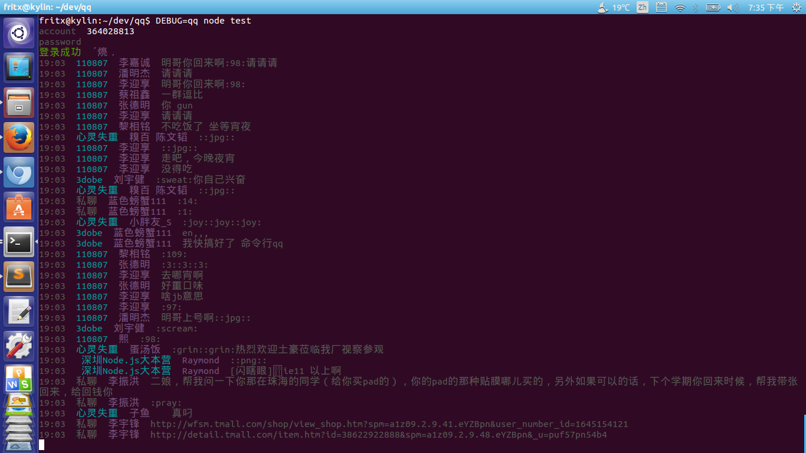

# qqlog

基于 [wqq](https://github.com/fritx/wqq) 开发的一个qq命令行

```
$ npm install --global qqlog
$ qqlog
```



## 有什么用

- 消息汇总显示
- 消息定制化显示
- 消息监控
- 自动化

## 祭逝去的webqq

<http://www.pingwest.com/bye-web-qq/> 愿协议用在
